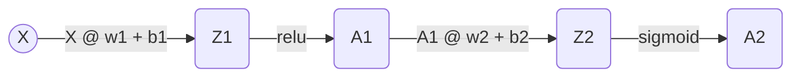
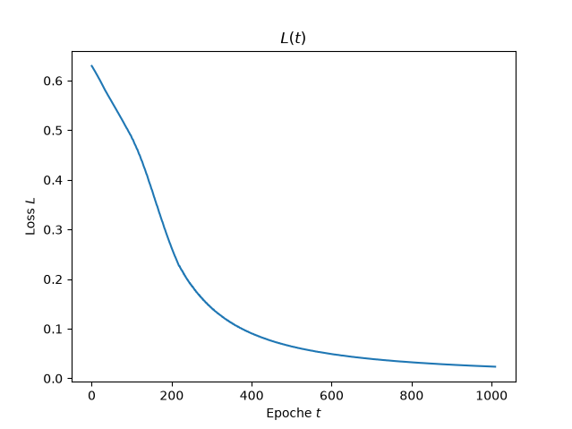

# Aufbau des KNN zur Erkennung eines $\oplus$ Netzes

Ziel des Projekts ist es, ein KNN zu trainieren, das eine $\oplus$ Schaltung erkennen kann. Es muss eine nicht linear trennbare Funktion abbilden können. Eine solche Abbildung kann von einem einzelnen Perceptron nicht mehr vorgenommen werden. Für diese Aufgabe ist ein mehrschichtiges KNN erforderlich. 

Es wird folgendes Design implementiert:

## 1. Forward Pass

**Die Schichten**
- $x$ - Input Layer 
- $w_1$ - Hidden Neurons Layer 
- $w_2$ - Output Neurons Layer 
- $b_1$ - Bias Neurons Layer 1  
- $b_2$ - Bias Neurons Layer 1

**Die Aktivierungsfunktionen**
- $\text{relu}(x)$ - Hidden Neuron Layer
- $\text{sigmoid}(x)$ - Output Layer

$$\text{relu}(x) = \text{max}(0,x)$$

$$\text{sigmoid}(x) = \frac{1}{1+e^{-x}}$$

--- 

**Schicht 1 (Input → Hidden):**

$$
Z_1 = \begin{pmatrix} x_1 & x_2 \end{pmatrix}
\cdot
\begin{pmatrix}
w_{11} & w_{12} & w_{13} & w_{14} \\
w_{21} & w_{22} & w_{23} & w_{24}
\end{pmatrix}
+
\begin{pmatrix} b_{11} & b_{12} & b_{13} & b_{14} \end{pmatrix}
$$

$$
A_1 = \text{relu}(Z_1) = \begin{pmatrix} a_{11} & a_{12} & a_{13} & a_{14} \end{pmatrix}
$$

**Schicht 2 (Hidden → Output):**

$$Z_2 = \begin{pmatrix} a_{11} & a_{12} & a_{13} & a_{14} \end{pmatrix}
\cdot
\begin{pmatrix} w_1 \\ w_2 \\ w_3 \\ w_4 \end{pmatrix}+ b_2
$$

$$A_2 = \text{sigmoid}(Z_2)$$

**Gesamtdarstellung:**

$$A_2 = \text{sigmoid}\left(
\text{relu}\left(
\begin{pmatrix} x_1 & x_2 \end{pmatrix}
\begin{pmatrix}
w_{11} & w_{12} & w_{13} & w_{14} \\
w_{21} & w_{22} & w_{23} & w_{24}
\end{pmatrix} + \begin{pmatrix} b_{11} & b_{12} & b_{13} & b_{14} \end{pmatrix}
\right)
\begin{pmatrix} w_1 \\ w_2 \\ w_3 \\ w_4 \end{pmatrix} + b_2 \right)$$

---

## 2. Loss-Funktion

Um zu messen, wie falsch das Netz gerade liegt, wird der Fehler über alle $n$ Trainingsbeispiele mit **Binary Cross-Entropy** berechnet (passend zur Sigmoid-Ausgabe bei einer 0/1-Klassifikation):

$$
L = -\frac{1}{n}\sum_{k=1}^n \Big[y_k \cdot \log(A_{2,k}) + (1-y_k)\cdot \log(1-A_{2,k})\Big]
$$

- $y_k$ - echtes Label von Beispiel $k$
- $A_{2,k}$ - Vorhersage des Netzes für Beispiel $k$
- Ziel des Trainings: $L$ minimieren

---

## 3. Backward Pass (Backpropagation)

Backpropagation berechnet die Gradienten $\partial L/\partial W$ für jeden Parameter, indem die Kettenregel rückwärts durch das Netz angewendet wird — vom Output zum Input:

$$
\frac{\partial L}{\partial w_1} = \frac{\partial L}{\partial A_2}\cdot\frac{\partial A_2}{\partial Z_2}\cdot\frac{\partial Z_2}{\partial A_1}\cdot\frac{\partial A_1}{\partial Z_1}\cdot\frac{\partial Z_1}{\partial w_1}
$$

Diese Kette wird nicht auf einmal, sondern **Schicht für Schicht** berechnet — jedes Zwischenergebnis heißt **Delta** ($dZ$, $dA$).

**Merkregel für die Transponierung:** Für jede Matrixmultiplikation $Y = X\cdot W$ im Forward Pass gilt beim Backward Pass immer:

$$
dX = dY \cdot W^T \qquad dW = X^T \cdot dY
$$

**Schritt 1 — Fehlersignal am Output:**

Für die Kombination Sigmoid + Binary Cross-Entropy vereinfacht sich $\dfrac{\partial L}{\partial A_2}\cdot\dfrac{\partial A_2}{\partial Z_2}$ auf:

$$
dZ_2 = \frac{1}{n}(A_2 - y)
$$

**Schritt 2 — Gradienten der Output-Schicht:**

$$
dW_2 = A_1^T \cdot dZ_2 \qquad db_2 = \sum_{k=1}^n dZ_2 \ \ (\text{axis}=0)
$$

**Schritt 3 — Fehler zur Hidden-Schicht zurückpropagieren:**

$$
dA_1 = dZ_2 \cdot w_2^T
$$

**Schritt 4 — durch die ReLU-Ableitung zurück:**

$$
\text{relu}'(z) = 
\begin{cases} 1 & z > 0 \\ 
0 & z \le 0 
\end{cases}
$$

$$
dZ_1 = dA_1 \odot \text{relu}'(Z_1)
$$

($\odot$ = Hadamard-Produkt, elementweise Multiplikation — nicht die Matrixmultiplikation $\cdot$. Notwendig, weil ReLU elementweise wirkt: $A_{1,i}$ hängt nur von $Z_{1,i}$ ab.)

**Schritt 5 — Gradienten der Hidden-Schicht:**

$$
dW_1 = X^T \cdot dZ_1 \qquad db_1 = \sum_{k=1}^n dZ_1 \ \ (\text{axis}=0)
$$

---

## 4. Update-Schritt (Gradient Descent)

Mit der Lernrate $\eta$ werden alle vier Parameter in Richtung des negativen Gradienten verschoben (siehe Basics.md Abschnitt 5):

$$
w_1 := w_1 - \eta \cdot dW_1 \qquad b_1 := b_1 - \eta \cdot db_1
$$

$$
w_2 := w_2 - \eta \cdot dW_2 \qquad b_2 := b_2 - \eta \cdot db_2
$$

---

# Implementierung in Python

Das KNN wurde in Python implementiert. Die Klasse `NeuralNetwork` setzt alle erforderlichen Arbeitsschritte um:

|Methode | Funktionalität |
|--------|----------------|
|`__init__()` | Initialisiert die Gewichte $w_1$, $w_2$, $b_1$ und $b_2$ mit zufälligen Werten | 
|`forward()`| Setzt den Forward Pass um. Als Eingabeparameter wird ein Trainingsdatensatz $X$ erwartet. Die Funktion berechnet $A_2$ |
|`backward()`| Nutzt $X$, $y$ sowie das intern gespeicherte $A_2$ aus `forward()`, um die im Backward Pass erforderlichen Berechnungen durchzuführen. Die Funktion ermittelt $dW_1$, $dW_2$, $db_1$, $db_2$. |
|`update()`| Die Funktion aktualisiert die Gewichte $w_1$, $w_2$ und die Bias Neuronen $b_1$, $b_2$ |
|`train()`| Orchestriert einen oder mehrere Trainingszyklen. Hier können die Gesamtzahl der Epochen $T$ und die Lernrate $\eta$ eingestellt werden.  |
|`visualize_Loss()`| Mit dieser Methode kann der Loss $L$ in Abhängigkeit der Epoche $t$ grafisch dargestellt werden. |
|`visualize_Boundary()`| Mit dieser Methode können die aktuellen Boundarys grafisch dargestellt werden. |

# Testdurchlauf

Das KNN wurde über $t=1000$ Epochen getestet:

Die Boundarys nähern sich den Zielwerten an. Das KNN trennt nicht linear.

Der Loss verringert sich mit fortschreitendem Training.

